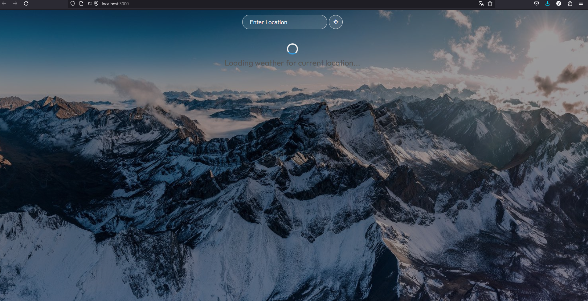
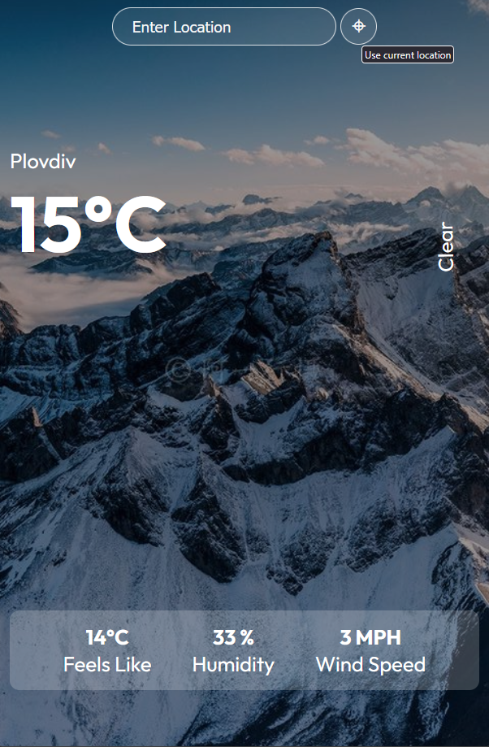
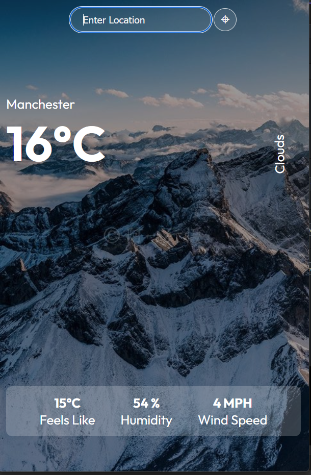

# 🌦️ React Weather App

A simple and modern weather app built with **React**, using the **OpenWeatherMap API**. Users can:

- Search for current weather by city name
- Automatically fetch weather using their current location
- View key weather details like temperature, humidity, wind speed, and "feels like"
- See a loading spinner while data is being retrieved

## 🚀 Features

- 🔍 Search weather by city name (press `Enter`)
- 📍 Use current geolocation automatically on load or manually via button
- ⏳ Animated loading spinner during data fetch
- ⚠️ Error handling for invalid city names or blocked location access

## 🛠️ Tech Stack

- [React](https://reactjs.org/)
- [Axios](https://axios-http.com/)
- [OpenWeatherMap API](https://openweathermap.org/api)

## 📸 Preview

### 🌍 Loading Screen

#### 📍 Weather by Current Location - Button 

### 📍 Weather by Location

#### 🌆 Choose City - Manchester

#### 🌆 Manchester

## ✅ Future Improvements

- Add 5-day weather forecast
- Toggle between Celsius and Fahrenheit
- Add dark/light mode
- Improve mobile responsiveness and UI animations

## 📄 License

MIT License.
